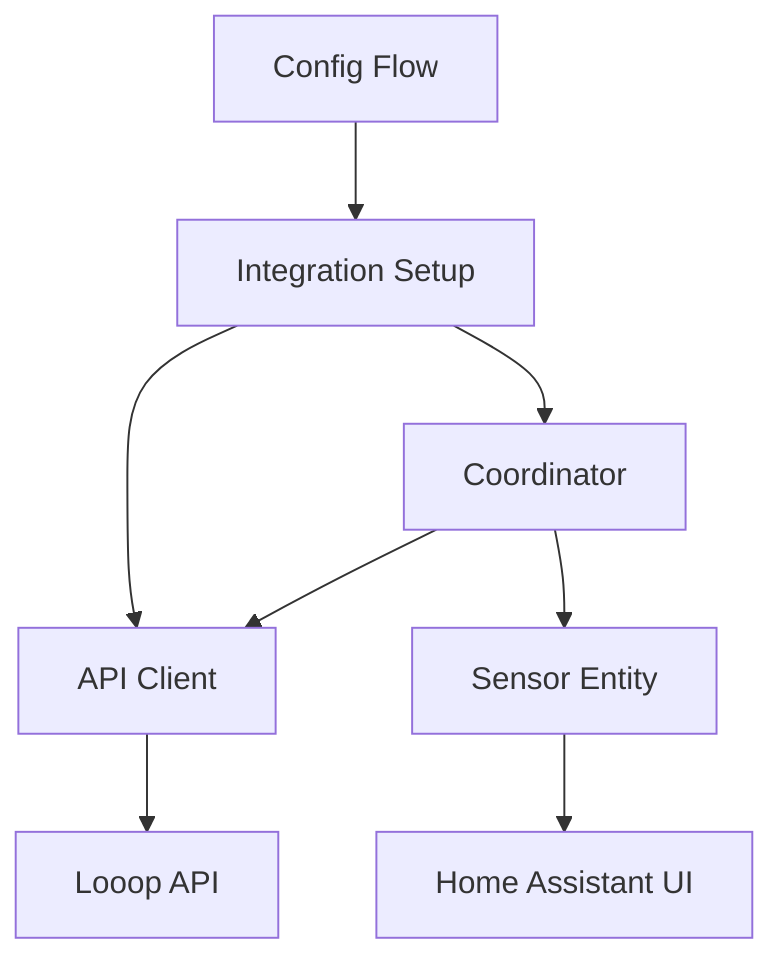

# Looop でんき Integration - Claude Code Development Documentation

このドキュメントは、Claude CodeによるLooop でんき統合の開発・保守のための技術情報を記載しています。

## アーキテクチャ概要

### ファイル構成

```
custom_components/looop_denki/
├── __init__.py           # エントリーポイント、設定管理
├── api.py               # APIクライアント
├── config_flow.py       # 設定フロー（UI設定）
├── const.py            # 定数定義
├── coordinator.py       # データ更新コーディネーター
├── sensor.py           # センサープラットフォーム
├── manifest.json       # 統合メタデータ
├── strings.json        # UI文字列（日本語）
└── translations/
    └── en.json         # UI文字列（英語）
```

### データフロー



## API詳細

### エンドポイント

- **URL**: `https://looop-denki.com/api/prices?select_area={area_code}`
- **メソッド**: GET
- **タイムアウト**: 10秒
- **更新間隔**: 5分

### レスポンス構造

```json
{
  "0": {  // 昨日のデータ
    "price_data": [10.5, 12.3, ...],  // 48要素（30分×48 = 24時間）
    "level": [0, -0.5, 0, 0.5, ...],   // 価格レベル
    "text": {                           // 詳細情報（辞書）
      "0": {"price": 10.5, "level": 0},
      "1": {"price": 12.3, "level": -0.5},
      // ...
    }
  },
  "1": {  // 今日のデータ（メイン）
    // 同様の構造
  },
  "2": {  // 明日のデータ
    // 同様の構造
  },
  "label": [0, 1, 2, ...],            // ラベル
  "timelist": ["0:00~0:29", "0:30~0:59", ...]  // 時間リスト
}
```

### 重要なポイント

1. **キー "1" が今日のデータ**: 最初に "0" が今日だと思って実装したが、実際は昨日だった
2. **textは辞書**: リストではなく、文字列キーを持つ辞書
3. **30分単位**: 1日48スロット（0-47）
4. **タイムスロット計算**: `hour * 2 + (1 if minute >= 30 else 0)`
5. **🚨 重要: textは1-based indexing**: price_dataは0-based（0-47）だが、textは1-based（1-48）

## コンポーネント詳細

### 1. APIクライアント (`api.py`)

#### 主要メソッド

- `async_get_prices()`: APIからデータ取得
- `get_current_price_info()`: 現在時刻の価格情報抽出
- `get_historical_data()`: 昨日・今日・明日のデータ取得
- `test_connection()`: 接続テスト

#### エラーハンドリング

```python
try:
    async with asyncio.timeout(REQUEST_TIMEOUT):
        # API call
except TimeoutError as err:
    raise LooopDenkiApiError("Request timeout") from err
except aiohttp.ClientError as err:
    raise LooopDenkiApiError(f"HTTP error: {err}") from err
```

### 2. データコーディネーター (`coordinator.py`)

- **目的**: データ更新の中央管理
- **更新間隔**: 5分（300秒）
- **エラー時**: UpdateFailed例外を発生

### 3. センサー (`sensor.py`)

#### 属性マッピング

| Home Assistant | API | 説明 |
|----------------|-----|------|
| `state` | `current_price` | メイン値（円/kWh） |
| `current_level` | `level[slot]` | 価格レベル |
| `current_text` | `text[slot]` | 詳細テキスト |
| `status` | 計算値 | でんき日和/注意報/警報 |

#### 価格ステータス判定ロジック

```python
def _get_price_status(self, level: float | None, price: float | None) -> str:
    if price >= 100:
        return "でんき警報"
    if level is not None:
        if level < 0:
            return "でんき日和"
        if level > 0:
            return "でんき注意報"
    # フォールバック: 価格ベース判定
    if price < 15:
        return "でんき日和"
    if price > 25:
        return "でんき注意報"
    return "通常"
```

### 4. 設定フロー (`config_flow.py`)

- **入力**: 電力エリア選択（01-10）
- **検証**: `test_connection()`でAPI接続確認
- **エラー**: `CannotConnect`例外

## テスト戦略

### テストファイル構成

```
tests/components/looop_denki/
├── __init__.py          # テストヘルパー
├── conftest.py         # フィクスチャ
├── test_config_flow.py # 設定フローテスト
└── test_sensor.py      # センサーテスト
```

### モックデータ構造

```python
@pytest.fixture
def mock_api_data():
    return {
        "0": {  # 昨日
            "price_data": [9.8, 11.2, 7.9, 14.5] * 12,
            "level": [0, -0.5, 0, 0.5] * 12,
            "text": {str(i): {"price": price, "level": level} for i, (price, level) in enumerate(...)},
        },
        "1": {  # 今日
            "price_data": [10.5, 12.3, 8.7, 15.2] * 12,
            "level": [0, -0.5, 0, 0.5] * 12,
            "text": {str(i): {"price": price, "level": level} for i, (price, level) in enumerate(...)},
        },
        "2": {  # 明日
            # 同様の構造
        },
    }
```

### 重要なテストケース

1. **正常な設定フロー**: エリア選択→接続テスト→統合作成
2. **センサー状態**: 正しい価格・属性表示
3. **API失敗時**: `SETUP_RETRY`状態への遷移
4. **データなし**: `STATE_UNAVAILABLE`表示

## デバッグとトラブルシューティング

### ログ設定

```yaml
logger:
  default: info
  logs:
    custom_components.looop_denki: debug
    # または homeassistant.components.looop_denki: debug（core統合の場合）
```

### 重要なログポイント

1. **API呼び出し**: `Retrieved price data for area {area_code}`
2. **データ処理**: `Processing price data for time slot {slot} (hour {hour})`
3. **データ構造**: `Price data keys: {keys}`, `Text data type: {type}`

### よくある問題と解決策

#### 1. `KeyError: 10` (初期の問題)

**原因**: `text`をリストとして扱っていた
**解決**: 辞書として処理、文字列キーでアクセス

```python
# 修正前（エラー）
current_text = text_list[current_30min_slot]

# 修正後（正常）
slot_key = str(current_30min_slot)
if slot_key in text_dict:
    text_data = text_dict[slot_key]
```

#### 2. 間違った時間の価格表示

**原因**: キー "0" を今日と誤解
**解決**: キー "1" を今日として使用

```python
# 修正前
today_data = price_data.get("0", {})

# 修正後
today_data = price_data.get("1", {})  # "1" is today
```

#### 3. 🚨 textの1-based indexing問題（重要な発見）

**原因**: price_data[0-47]とtext['1'-'48']の索引ずれ
**症状**: 17:22時点で正しい価格14.05が取得されるが、textデータが1つずれる
**解決**: textアクセス時に+1してインデックス調整

```python
# 修正前（間違った価格）
slot_key = str(current_30min_slot)  # 0-based
if slot_key in text_dict:
    current_text_price = text_dict[slot_key]["price"]

# 修正後（正しい価格）
text_slot_key = str(current_30min_slot + 1)  # 1-based indexing
if text_slot_key in text_dict:
    current_text_price = text_dict[text_slot_key]["price"]
```

**実例（デバッグログから）**:
- 現在時刻: 17:22 → スロット34
- price_data[34] = 14.05 ✅ 正しい価格
- text['34'] = 13.84 ❌ 間違った価格（1つ前のスロット）
- text['35'] = 14.05 ✅ 正しい価格

#### 4. エンティティIDの不一致

**実際**: `sensor.looop_tenki_current_price_dong_jing_dian_li`
**期待**: `sensor.looop_denki_current_price_03`

**原因**: 日本語エリア名の自動変換
**対応**: テストで実際のエンティティIDを使用

## 保守とアップデート

### 定期確認項目

1. **APIエンドポイント**: Looop でんきサイトの変更確認
2. **データ構造**: レスポンス形式の変更確認
3. **電力エリア**: 新エリア追加の確認
4. **Home Assistant互換性**: 新バージョンでの動作確認

### アップデート手順

1. **コード変更**
2. **テスト実行**: `python -m pytest tests/ -v`
3. **Linting**: Ruff, pylintエラー修正 `scripts/lint`
4. **統合テスト**: 実際のHome Assistantでの動作確認 `scripts/develop`

### コードスタイル

- **Ruff**: Linting and formatting
- **pylint**: 追加の品質チェック
- **Type hints**: 必須
- **Docstring**: Google style

## 実装時の注意点

### セキュリティ

- **APIキー不要**: 公開APIのため認証なし
- **レート制限**: 5分間隔で適切な頻度
- **エラー情報**: ログに機密情報を含めない

### パフォーマンス

- **aiohttp session**: 再利用でコネクション最適化
- **タイムアウト**: 10秒でハング防止
- **メモリ**: 大きなレスポンスデータは適切に処理

### 国際化

- **日本語UI**: strings.json（デフォルト）
- **英語UI**: translations/en.json
- **価格ステータス**: 日本語（でんき日和等）を維持

## Home Assistant統合のベストプラクティス

1. **ConfigEntry type alias**: 型安全性
2. **DataUpdateCoordinator**: 統一されたデータ管理
3. **Entity device_info**: デバイスとしてグループ化
4. **Unique ID**: 安定したエンティティ識別
5. **State class**: `measurement`で履歴記録
6. **Device class**: `monetary`で適切な表示

## 今後の拡張可能性

### 考えられる機能追加

1. **複数日データ**: 昨日・明日の価格センサー
2. **時間別センサー**: 各時間帯の価格予測
3. **統計センサー**: 日次・週次・月次平均
4. **しきい値アラート**: カスタム価格でのアラート
5. **コスト計算**: 電力使用量との連携

### 技術的改善

1. **キャッシュ機能**: 同一データの重複取得防止
2. **オフライン対応**: ネットワーク断絶時の動作
3. **設定オプション**: 更新間隔のカスタマイズ
4. **エラー回復**: 自動リトライ機能

---

このドキュメントは、Claude Codeが効率的に統合を理解・保守できるように作成されました。技術的詳細と実装のコンテキストを保持し、将来の開発作業を支援します。
